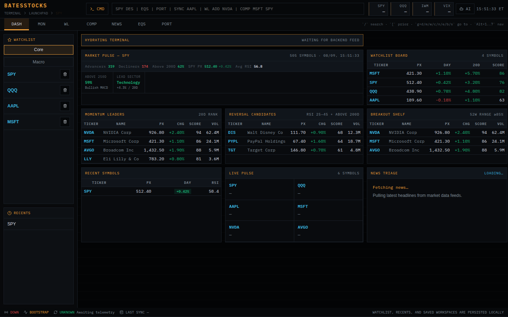
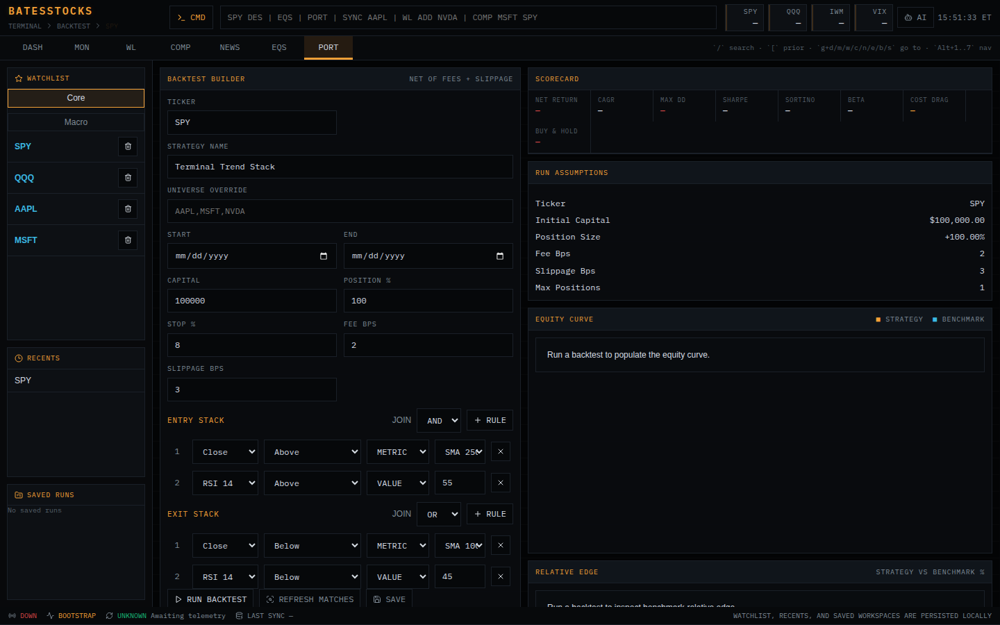

# BatesStocks

**A self-hosted market research terminal for analysis—not order execution.**

[](https://github.com/wtbates99/batesstocks/actions/workflows/ci.yml)
[](https://www.python.org/)
[](frontend/)
[](LICENSE)



BatesStocks combines watchlists, market monitoring, technical analysis,
screening, backtesting, and news review in one
dense workspace. FastAPI serves the application, DuckDB stores local research
state, and React provides the terminal-style frontend.

> BatesStocks is not a brokerage, investment service, trading system, or
> source of financial advice. It does not place orders.

## What it does

- Builds dashboards for quotes, movers, breadth, sectors, watchlists, and snapshots.
- Provides security research views with charts, overlays, signals, recent bars, news, and related names.
- Supports configurable strategy screens and historical backtests with saved local state.
- Pulls market data through `yfinance` into a local DuckDB analytics file.
- Fetches live quotes on request and keeps the large historical refresh separate from the API.
- Supports one bounded daily sync and one replaceable latest export.



## Run with Docker

```bash
git clone https://github.com/wtbates99/batesstocks.git
cd batesstocks
mkdir -p data backups
docker build -t batesstocks:local .

docker run --rm \
  -p 8000:8000 \
  -e DB_PATH=/app/data/stock_data.duckdb \
  -e BACKUP_DIR=/app/exports \
  -e AUTO_SYNC_ON_START=false \
  -e AUTO_SYNC_SCHEDULED=false \
  -e AI_ENABLED=false \
  -v "$(pwd)/data:/app/data" \
  -v "$(pwd)/backups:/app/backups" \
  batesstocks:local
```

Open <http://localhost:8000>.

For a Raspberry Pi, use the published ARM64 image and the measured tuning/deployment
guide in [docs/PI_PERFORMANCE_PLAN.md](docs/PI_PERFORMANCE_PLAN.md). It avoids building
the frontend and Python environment on the Pi.

## Local development

Backend:

```bash
uv sync --locked --all-groups
uv run uvicorn main:app --host 127.0.0.1 --port 8000
```

Frontend:

```bash
cd frontend
npm ci
npm run dev
```

The Vite frontend uses deterministic demo market data when the corresponding
API state is unavailable. Screenshots in this README use that demo state; they
do not represent current quotes or investment results.

## Configuration

| Variable | Purpose |
| --- | --- |
| `DB_PATH` | DuckDB database path |
| `BACKUP_DIR` | Latest export directory |
| `AUTO_SYNC_ON_START` | Bootstrap market data on an empty startup |
| `AUTO_SYNC_SCHEDULED` | Enable the daily after-close scheduler for a single-instance deployment |
| `DUCKDB_MEMORY_LIMIT` | DuckDB memory cap |
| `DUCKDB_THREADS` | DuckDB worker count |
| `AI_ENABLED` | Enable the dormant AI route and frontend; false by default |
| `AI_PROVIDER` | Default AI provider when AI is explicitly enabled |
| `AI_CHAT_TOKEN` | Token required for server-side AI chat unless explicitly public |
| `ALLOW_BYOK_AI` | Permit browser-supplied AI keys; false by default |
| `OLLAMA_HOST` / `OLLAMA_MODEL` | Ollama-compatible endpoint and model |
| `OPENAI_API_KEY` / `ANTHROPIC_API_KEY` | Optional cloud AI providers |
| `CORS_ORIGINS` | Allowed browser origins |
| `ALLOWED_HOSTS` | Host names accepted by the application; configure this in production |
| `TRUST_CLOUDFLARE_CONNECTING_IP` | Trust Cloudflare's client-IP header after the origin is restricted to the tunnel |
| `RATE_LIMIT_*_PER_MINUTE` | Per-client limits for API, provider, strategy, and system routes |
| `MAX_REQUEST_BODY_BYTES` | Maximum declared request-body size; 256 KiB by default |
| `PERSIST_STRATEGY_RUNS` | Store anonymous backtest runs; false by default |
| `ENABLE_API_DOCS` | Expose FastAPI documentation; false by default |
| `SYSTEM_ADMIN_TOKEN` | Token required for every `/system/*` endpoint |

Copy `.env.example` and keep credentials outside version control.

In production, expose the container only through a trusted reverse proxy or tunnel. The
Compose file binds its optional host port to loopback. Set a long random
`SYSTEM_ADMIN_TOKEN`, and do not send it to browser code. Public status displays use the
sanitized `/terminal/sync-status` and `/terminal/freshness` routes.

## Validation

```bash
uv run ruff check backend main.py tests
uv run pytest

cd frontend
npm run typecheck
npm run build
npm run test:e2e
```

## Data and privacy

Persistent watchlists, snapshots, backtests, and research state remain in the
configured local DuckDB file. External market-data and optional AI providers
receive the requests needed for the features you enable; inspect their terms
and privacy policies before using them with sensitive research.

## License

BatesStocks is **source available** under the
[PolyForm Noncommercial License 1.0.0](LICENSE). Personal and noncommercial
use is permitted under those terms. Commercial use requires a
[separate license](COMMERCIAL-LICENSE.md).
